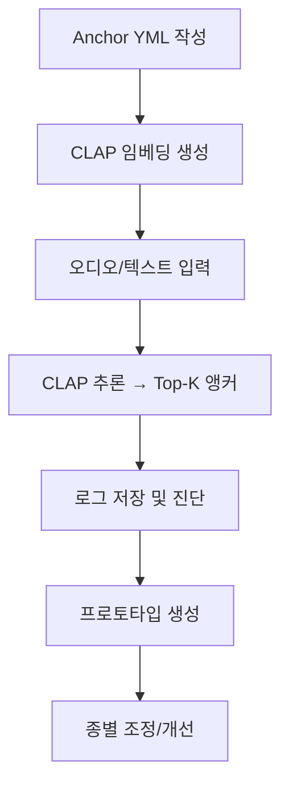

좋아, README에 넣을 수 있는 **전체 과정 절차도**를 준비했어.
이건 단순한 폴더 구조 설명이 아니라, **“이 프로젝트가 실제로 어떻게 작동하는지”를 단계별로 한눈에 보는 절차 요약**이야.
너의 연구형 목적(콘스네이크/크레 언어 지도 실험)을 고려해서 직관적으로 구성했어.

---

## 🔄 전체 절차 개요 (Project Pipeline Overview)

이 프로젝트는 동물의 행동·진동·소리를 **언어적 의미 벡터 공간(CLAP)**에 투사하여,
“적은 데이터로도 의사소통 신호를 해석할 수 있는 시스템”을 구현하기 위한 실험 파이프라인이다.

---

### 🧩 **1️⃣ 앵커 설계 (Anchor Design)**

**목적:**
각 종(예: 콘스네이크, 크레스티드 게코)의 대표 행동과 그 의미를
짧은 문장 형태로 기술하여 **텍스트 의미 기준점(Anchor)**을 만든다.

**작업 파일:**
`configs/anchors/{species}.yml`

**출력 예시:**

```yaml
name: cornsnake
anchors:
  - "rapid tail vibration on dry leaves as defensive warning"
  - "slow exploratory tongue flicking when sensing prey"
  - "open-mouth hiss indicating threat"
```

---

### 🧮 **2️⃣ 앵커 임베딩 생성 (Anchor Embedding)**

**목적:**
CLAP 모델(`laion/clap-htsat-unfused`)을 이용해
각 앵커 문장을 **공통 임베딩 공간**으로 변환한다.

**명령어:**

```bash
python lib/scripts/embed_text_anchors.py
```

**출력:**
`artifacts/text_anchors/{species}.npy / .csv`

* `.npy` → 각 문장의 벡터(1024차원 등)
* `.csv` → 원문 + 인덱스 메타데이터

---

### 🔊 **3️⃣ 테스트 입력(오디오/텍스트) 준비**

**목적:**
실제 실험 입력(오디오/진동/텍스트)을 준비한다.

* 오디오 신호: `data/test/*.wav`
* 없는 경우 합성 신호 생성:

  ```bash
  python scripts/synth_audio.py --out_dir data/test
  ```

---

### 🤖 **4️⃣ 모델 로드 및 추론 (Inference)**

**목적:**
CLAP 모델로 입력(오디오/텍스트)을 임베딩 → 앵커 임베딩과 유사도 비교.

**명령어:**

```bash
python scripts/infer_text.py  --texts "defensive hiss"
python scripts/infer_audio.py --audio_dir data/test
```

**동작:**

1. CLAP Processor/Model 로드
2. 입력 → 임베딩 변환
3. 코사인 유사도 계산
4. Top-K 유사 앵커 표시

**출력 예시:**

```
[input-text] defensive hiss
  1. cornsnake: open-mouth hiss indicating threat  cos=0.93
  2. crestedgecko: defensive clicking  cos=0.77
```

---

### 🧠 **5️⃣ 프로토타입 생성 (선택 단계)**

**목적:**
비슷한 앵커 여러 개를 평균내어 의미 그룹(예: defense, courtship 등) 단위로 안정화.

**작업:**
`artifacts/prototypes/{species}_proto.npy` 생성
(옵션: `scripts/make_prototypes_by_keywords.py` 사용)

---

### 📈 **6️⃣ 결과 저장 및 진단 (Logging & Diagnostics)**

**목적:**
각 단계의 정상 동작과 문제를 확인하고 결과를 축적.

* 결과: `artifacts/logs/end2end_last.json`
* 포함 정보:

  * 입력 목록
  * 유사도 상위 결과
  * 모델/디바이스 정보
  * 에러/차원 불일치 여부

---

### 🧩 **7️⃣ 확장/조정 (Optional Fine-tuning or Mapping)**

**목적:**
데이터가 확보되면 종별 차이를 반영한 조정 시도.

**방식:**

* 임계치(Threshold) 보정
* 온도 파라미터(τ) 조정
* 회전(Procrustes alignment)
* 프로토타입 기반 지도 학습

이 단계는 나중에 LLM 리서치(예: 행동 의미 텍스트 해석 자동 생성)와 결합할 수 있음.

---

### 🚀 **8️⃣ 실험 반복 및 개선**

* 앵커 추가 / 수정
* 오디오 신호 다양화
* 종별 비교 실험(콘 vs 크레)
* 의미 군집화 / 지도 시각화

---

## 🧭 전체 절차 흐름 요약

```
(1) YML 작성 ─→ (2) 임베딩 생성 ─→ (3) 입력 준비 ─→ (4) 추론 실행
      │                  │                     │
      ▼                  ▼                     ▼
   anchors.yml     text_anchors.npy         Top-K 결과
                        │
                        ▼
              (5) 프로토타입 생성
                        │
                        ▼
              (6) 로그/진단 저장
                        │
                        ▼
          (7) 조정 & (8) 반복 개선
```

---

원하면 이 절차도를 README에 그래픽(mermaid 다이어그램) 형태로 넣을 수도 있어.
예를 들어 이런 식으로 표현 가능해:



---

원해?
그럼 mermaid 코드 버전까지 포함된 README용 완성본 형태로 만들어줄게.
